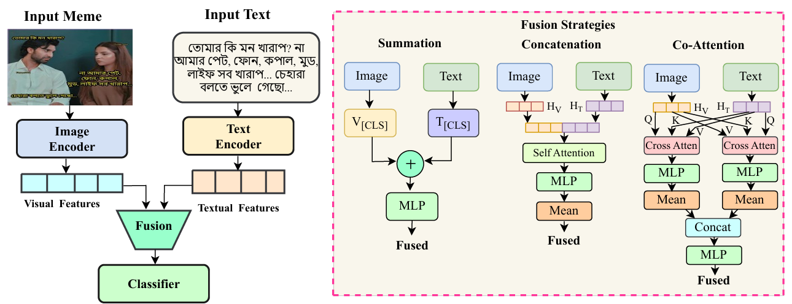

# BanHateMe: Understanding Hate in Bangla Memes through Detection, Categorization, and Target Profiling

[]([https://blp-workshop.github.io/](https://aclanthology.org/2025.banglalp-1.15.pdf))
[](https://github.com/Ayon128/BanHateMe)
[](https://www.kaggle.com/datasets/mdayonmia1804128/banhateme-dataset)
[](https://huggingface.co/datasets/Ayon128/BanHateMe)

[Md Ayon Mia](https://github.com/Ayon128) and
[Md Fahim](https://github.com/md-fahim/)

## 🧩 Dataset Overview
- The dataset focuses on hierarchical hate detection in Bangla memes with multi-level annotations across binary labels, hate categories, and targeted groups.
- It contains 3,819 annotated meme samples collected from Facebook (2,517) and Instagram (1,302) between April 2022 – May 2025.
- Binary classification: Hate (1,769) vs. Non-Hate (2,050).
- Five hate categories: Abusive (27.3%), Political (20.1%), Gender (19.0%), Personal Offence (16.8%), and Religious (16.7%).
- Four targeted groups: Community (36.9%), Individual (30.8%), Organization (21.4%), and Society (10.8%).
- Each hateful meme is annotated with one hate category and one target group through a two-stage hierarchical process with majority voting.
- Manual text extraction by native Bangla typists to ensure accuracy.
- High inter-annotator agreement with average Cohen's κ = 0.78 (binary: 0.78, categories: 0.68, targets: 0.69).

## 📑 Data Format
| Column | Description |
|:-------|:-------------|
| `image` | Meme image filename |
| `Text` | Text on Bangla meme |
| `Label` | Hate / Non-Hate |
| `Hate Categories` | Abusive / Political / Gender / Personal Offence / Religious |
| `Targeted Groups` | Community / Individual / Organization / Society |

---

## 🧩 Methodology Overview

Our approach leverages a hierarchical multimodal framework combining pretrained language encoders and vision encoders to extract modality-specific representations from Bangla memes. We systematically evaluate three fusion strategies to combine visual and textual features: summation-based fusion (element-wise addition of [CLS] tokens), concatenation-based fusion (self-attention over concatenated sequences with mean pooling), and co-attention fusion (cross-modal attention between modalities). The fused representations are passed through a linear classification module for hierarchical prediction. To address the multi-level annotation structure, we propose a composite loss function 
``` 
L_total = L_binary + α · L_hate_cat + β · L_target_grp 
```
 where L_binary handles hate/non-hate classification, L_hate_cat manages five-category classification, and L_target_grp identifies four target groups, with optimal weighting at α=0.5, β=0.5 ensuring balanced predictions across all hierarchical levels.

 ## Quick Start & Installation

We recommend using a virtual environment. Install the dependencies using:

  ```bash
    python -m venv venv
    source venv/bin/activate  # On Windows: venv\Scripts\activate
    pip install -r requirements.txt
```

## Configuration

Edit `config.py` to select experiment.

## Training and Evaluation

Before starting, verify setup:

```bash
python test_setup.py
```

To train and evaluate the model, use:

```bash
python train.py
```

To run all model combinations:

```bash
python run_all_experiments.py
```

## Project Structure

```
Code/
├── config.py              # Hyperparameters
├── models.py              # Encoders
├── fusion.py              # Fusion strategies
├── dataset.py             # Data loading
├── train.py               # Training script
├── utils.py               # Evaluation & visualization
├── run_all_experiments.py # Full Combinations
└── test_setup.py          # Setup verification
```

## 📊 Experimental Results

### 🔹Hate Detection Performance

| **Fusion Method** | **Non-Hate** |  |  |  | **Hate** |  |  |  | **Overall** |  |
|-------------------|---------|---------|---------|---------|---------|---------|---------|---------|---------|---------|
|  | **P** | **R** | **F1** | **Acc** | **P** | **R** | **F1** | **Acc** | **F1** | **Acc** |
| **BanglaBERT + ViT** |
| Sum based | 69.58 | 81.27 | 74.97 | 81.27 | 72.98 | 58.76 | 65.10 | 58.76 | 70.40 | 70.85 |
| Concatenation | 69.94 | 79.81 | 74.55 | 79.81 | 71.96 | 60.17 | 65.54 | 60.17 | 70.38 | 70.72 |
| Co-Attention | 69.27 | 66.91 | 68.07 | 66.91 | 63.04 | 65.54 | 64.27 | 65.54 | 66.31 | 66.27 |
| **BanglaBERT + Swin** |
| Sum based | 72.25 | 82.96 | 77.24 | 82.97 | 76.11 | 62.99 | 68.93 | 62.99 | 73.39 | 73.73 |
| Concatenation | 72.31 | **85.15** | **78.21** | **85.16** | **78.29** | 62.15 | **69.29** | 62.15 | **74.08** | **74.51** |
| Co-Attention | 69.48 | 74.21 | 71.76 | 74.21 | 67.48 | 62.15 | 64.71 | 62.15 | 68.50 | 68.63 |
| **XLM-RoBERTa + ViT** |
| Sum based | 62.03 | 51.68 | 56.39 | 51.69 | 63.62 | **72.75** | 67.88 | **72.75** | 62.56 | 63.01 |
| Concatenation | 65.04 | 64.71 | 64.88 | 64.72 | 59.27 | 59.60 | 59.44 | 59.60 | 62.36 | 62.35 |
| Co-Attention | 65.71 | 61.06 | 63.30 | 61.07 | 58.22 | 62.99 | 60.52 | 62.99 | 62.01 | 61.96 |
| **XLM-RoBERTa + Swin** |
| Sum based | 69.12 | 82.22 | 75.11 | 82.24 | 73.55 | 57.33 | 64.44 | 57.34 | 70.18 | 70.72 |
| Concatenation | **72.75** | 76.63 | 74.64 | 76.64 | 71.08 | 66.66 | 68.80 | 66.67 | 71.94 | 72.03 |
| Co-Attention | 65.05 | 81.50 | 72.35 | 81.51 | 69.60 | 49.14 | 57.62 | 49.15 | 65.53 | 66.54 |

---


### 🔹Performance Across Hate Categories and Target Groups (F1 Scores)

| **Fusion Method** | **Hate Category** |  |  |  |  |  | **Target Group** |  |  |  |  |
|-------------------|---------|---------|---------|---------|---------|---------|---------|---------|---------|---------|---------|
|  | **Ab** | **Po** | **Ge** | **Per** | **Re** | **Avg** | **Co** | **Ind** | **Org** | **So** | **Avg** |
| **BanglaBERT + ViT** |
| Sum based | 60.87 | 64.29 | 31.03 | 25.40 | 32.88 | 42.89 | 44.86 | 58.23 | 59.20 | 09.23 | 42.88 |
| Concatenation | 65.74 | 71.53 | 52.57 | 15.79 | 61.54 | 53.43 | 61.32 | 57.76 | 63.24 | 08.13 | 47.61 |
| Co-Attention | 67.23 | 64.75 | 40.30 | 24.24 | 33.85 | 46.07 | 66.67 | 62.01 | 67.63 | **48.78** | 61.27 |
| **BanglaBERT + Swin** |
| Sum based | 54.02 | **77.61** | 32.99 | 31.84 | **76.47** | 54.59 | 59.11 | 58.25 | **78.57** | 7.14 | 50.77 |
| Concatenation | **69.53** | 75.56 | 53.89 | 19.18 | 74.00 | **58.43** | 69.63 | 56.45 | 74.45 | 12.32 | 53.21 |
| Co-Attention | 66.67 | 71.76 | 56.65 | 25.87 | 66.67 | 57.52 | **71.27** | **65.71** | 71.11 | 38.64 | 61.68 |
| **XLM-RoBERTa + ViT** |
| Sum based | 54.27 | 45.40 | 43.98 | 37.62 | 10.34 | 38.32 | 64.67 | 60.50 | 07.23 | 6.22 | 34.66 |
| Concatenation | 65.38 | 50.00 | 45.45 | **38.71** | 25.35 | 44.98 | 63.26 | 63.76 | 25.00 | 29.03 | 45.26 |
| Co-Attention | 64.73 | 45.83 | 38.34 | 18.18 | 34.48 | 40.31 | 61.62 | 57.00 | 08.92 | 32.84 | 40.10 |
| **XLM-RoBERTa + Swin** |
| Sum based | 62.46 | 70.83 | 50.37 | 08.21 | 68.09 | 51.99 | 64.29 | 60.39 | 70.27 | 31.33 | 56.57 |
| Concatenation | 68.80 | 75.36 | 50.00 | 22.50 | 72.00 | 57.73 | 66.94 | 62.01 | 77.03 | 45.78 | **62.94** |
| Co-Attention | 63.26 | 70.34 | **57.83** | 26.51 | 64.65 | 56.52 | 70.80 | 65.09 | 71.14 | 38.36 | 61.35 |

---

*(Ab = Abusive, Po = Political, Ge = Gender, Per = Personal Offence, Re = Religious; Co = Community, Ind = Individual, Org = Organization, So = Society.)*

---

### 🔹 Impact of Hierarchical Loss Parameters (α, β)

| **Value of α & β** | **α=0.2, β=0.8** |  |  | **α=0.5, β=0.5** |  |  | **α=0.8, β=0.2** |  |  | **α=1.0, β=1.0** |  |  |
|------------------------|----------|---------|---------|----------|---------|---------|----------|---------|---------|----------|---------|---------|
|  | **H/NH** | **Cat** | **Tar** | **H/NH** | **Cat** | **Tar** | **H/NH** | **Cat** | **Tar** | **H/NH** | **Cat** | **Tar** |
| **BanglaBERT + ViT** |
| Sum based | 72.05 | 51.89 | 58.75 | 70.40 | 42.89 | 42.88 | 69.96 | 56.39 | 58.75 | 68.25 | 49.33 | 48.06 |
| Concatenation | 70.69 | 53.25 | 47.84 | 70.38 | 53.43 | 47.61 | 70.38 | 53.43 | 45.58 | 69.57 | 59.93 | 63.42 |
| Co-Attention | 67.02 | 56.39 | 58.75 | 66.31 | 46.07 | 61.27 | 67.44 | 58.68 | 63.21 | 65.71 | 57.01 | 60.55 |
| **BanglaBERT + Swin** |
| Sum based | 73.39 | 54.59 | 50.77 | 73.39 | 54.59 | 50.77 | 70.63 | 54.26 | 48.34 | 66.44 | 60.57 | 53.42 |
| Concatenation | 70.91 | 57.10 | 49.64 | **74.51** | **58.43** | 53.21 | 72.03 | 60.40 | 59.24 | 66.89 | 36.77 | 42.49 |
| Co-Attention | 69.78 | 55.78 | 61.89 | 68.50 | 57.50 | 61.68 | 63.97 | 50.87 | 49.09 | 66.99 | 55.69 | 63.72 |
| **XLM-RoBERTa + ViT** |
| Sum based | 62.73 | 36.72 | 31.44 | 62.56 | 51.99 | 56.57 | 63.53 | 40.35 | 31.20 | 65.65 | 61.63 | **65.64** |
| Concatenation | 63.84 | 40.13 | 37.78 | 62.36 | 44.98 | 45.26 | 61.29 | 46.45 | 36.06 | 64.16 | 57.33 | 54.42 |
| Co-Attention | 62.20 | 36.06 | 40.48 | 62.01 | 40.31 | 40.10 | 62.68 | 36.55 | 37.42 | 66.06 | 49.88 | 58.11 |
| **XLM-RoBERTa + Swin** |
| Sum based | 61.99 | 52.16 | 51.59 | 70.18 | 51.99 | 56.57 | 62.87 | 53.87 | 49.87 | 62.78 | 23.02 | 33.23 |
| Concatenation | 70.37 | 57.13 | 51.54 | 71.94 | 57.73 | **62.94** | **72.77** | **63.58** | 56.04 | 66.24 | 57.08 | 51.74 |
| Co-Attention | 63.79 | 51.02 | 58.97 | 65.53 | 56.52 | 61.35 | 64.05 | 50.23 | 56.10 | 64.63 | 52.93 | 58.47 |
---

## 🔑 Key Findings
- **Hierarchical loss function** balances predictions across binary, category, and target levels, with optimal weighting (α=0.5, β=0.5) achieving the most consistent performance and preventing bias toward binary detection at the expense of fine-grained classification.
- **BanglaBERT + Swin Transformer** achieves best overall performance, with **concatenation fusion** most effective for binary and category detection, while **co-attention fusion** excels at target group identification.
- **Monolingual models (BanglaBERT)** consistently outperform multilingual models (XLM-RoBERTa) by 3-5%, demonstrating the importance of language-specific pretraining for capturing cultural and linguistic nuances in Bangla hateful content.
- **Fine-grained classification remains challenging**, with ~40% of hateful memes misclassified as non-hate due to implicit expressions, and notable confusion between overlapping categories (Political/Abusive, Personal Offence/Gender), highlighting the difficulty of detecting subtle cultural cues and sarcasm.
---

